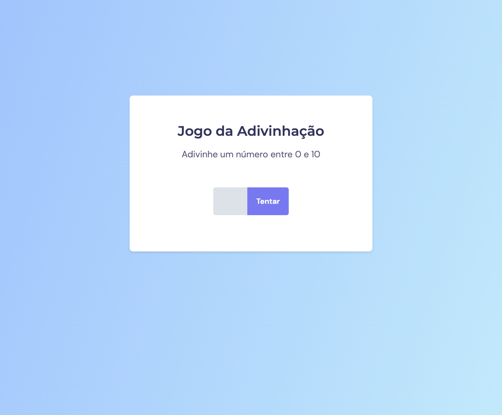

# Jogo Adivinhação

> Curso Explorer | Rocketseat

Jogo desenvolvido no curso Explorer da rocketseat

* Contruindo um jogo com manipulação de DOM, e os conhecimentos de JavaScript aprendidos.

[🔗 Clique aqui para acessar](https://edgar-lins.github.io/jogo-adivinhacao/)

- JavaScript
- HTML
- CSS

## 📩 Contato

linss.edgar@gmail.com
